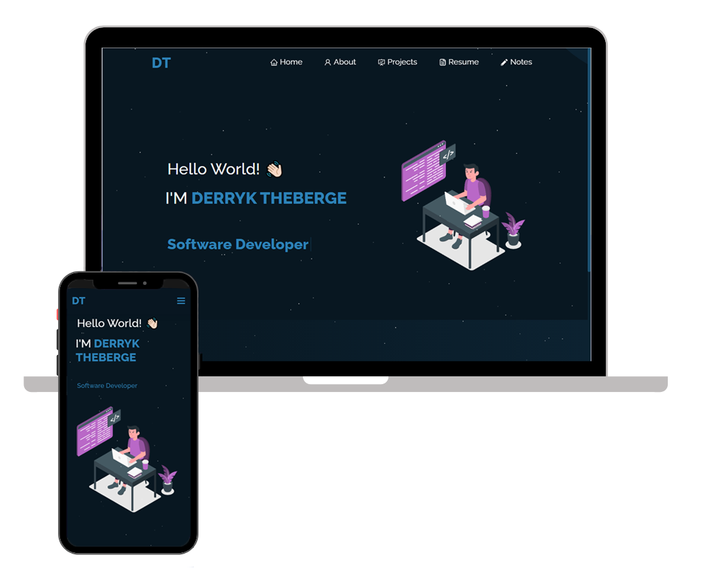

<h2 align="center">
  Portfolio Website 
  <a href="http://dtheberge.com/" target="_blank">dtheberge.com</a>
</h2>

  

 

## Built With :heart:

My personal portfolio <a href="http://dtheberge.com/" target="_blank">dtheberge.com</a> which features some of my github projects, my resume, and technical skills. 

This project was built using these technologies.

- React.js
- Node.js
- Express.js
- CSS3
- VsCode
- Vercel

## Features

**📖 Multi-Page Layout**
**🎨 Styled with React-Bootstrap and CSS**
**📱 Fully Responsive**

### Show your support

Give a ⭐ if you like this website!

